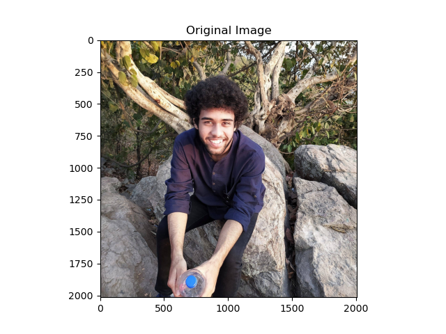
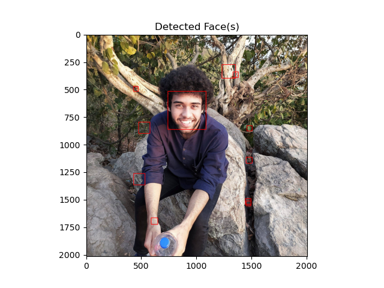
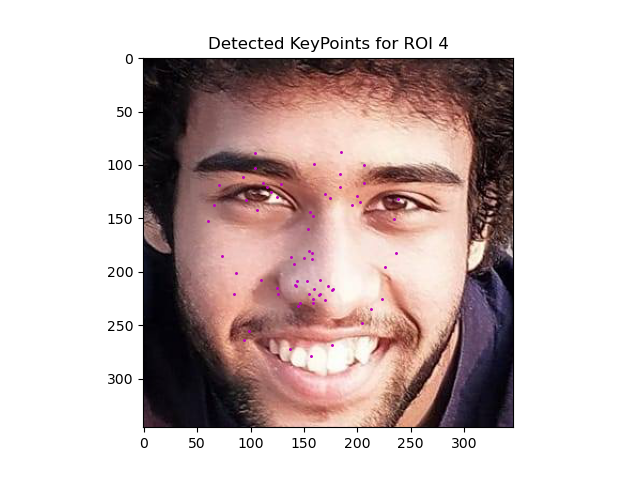

## Facial Key Points Detector

This is my attempt at building a Facial Key Points Detector.  Facial keypoints include points around the eyes, nose, and mouth on a face and are used in many applications. These applications include: facial tracking, facial pose recognition, facial filters, and emotion recognition.  

## The Pipeline
1. Given a picture, faces in it are detected using a [Haar-Cascade](https://towardsdatascience.com/face-detection-with-haar-cascade-727f68dafd08)
2. Next, on each of the localised faces, some cropping, standardisation, normalisation and resizing techniques are applied before presenting it to the facial key point recogniser.
3. The keyoint recogniser runs a CNN to warp the image and maps it to 68 key points.

## A Quick Demo

The input image:
{:class="img-responsive"}

The detected faces (Haar Casacde detects some aberrant faces)
{:class="img-responsive"}

And then, finally, the detected keypoints of my own face:
{:class="img-responsive"}

Thus, this is an example of my Facial Keypoint Detector being applied to my own image :p  
Pretty, ain't it!? XD  
